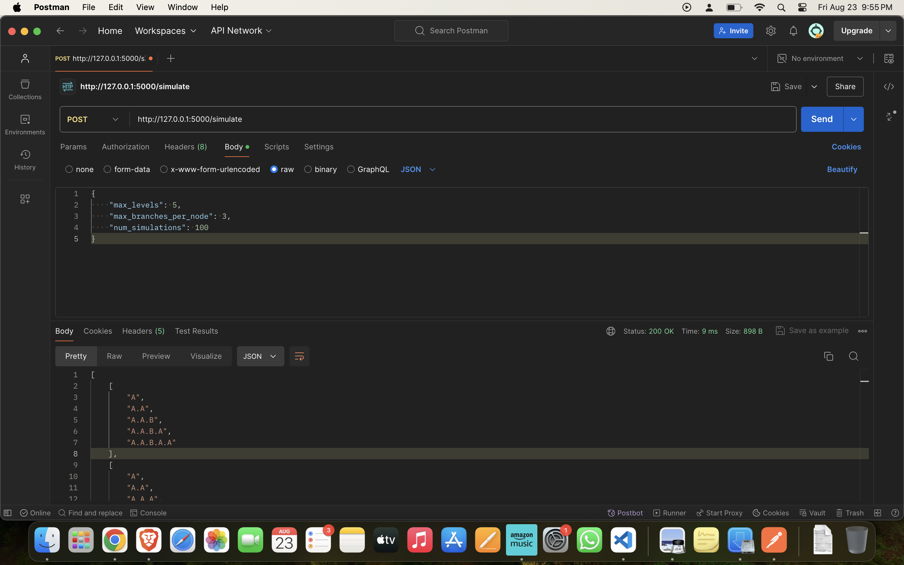

# 🌳 Monte Carlo Tree Simulation API

This repository contains a Flask-based API for running Monte Carlo Tree Simulations. The API generates a tree structure and performs simulations to traverse the tree, returning different outcome paths.

## 🚀 How to Run the API

1. **Clone the Repository**
   ```bash
   git clone <https://github.com/soodaryan/Monte-Carlo-Tree-Simulation.git>
   cd <repository-directory>
2. **Install the Required Libraries Make sure you have Flask installed. If not, you can install it using pip:**
    ```bash
    pip install -r requirements.txt

3. **Run the API To start the API, run the following command in your terminal:**
    ```bash
    python api.py
    
You should see output similar to this:

* Running on http://127.0.0.1:5000/ (Press CTRL+C to quit)

## 🛠️ Using the API with Postman
You can test the API using Postman. Here's how:

1. **Set the Request Method and URL**
    Method: POST
    URL: http://127.0.0.1:5000/simulate
2. **Set the Request Body**
    Select raw and set the body type to JSON. Enter the following JSON in the body:

    ```json
    {
        "max_levels": 5,
        "max_branches_per_node": 3,
        "num_simulations": 100
    }
    
3. **Send the Request**
Click Send to send the request to the API. The API will return a JSON array of outcome paths.

## 📷 Postman Example
Below is a screenshot of Postman with a sample request:
